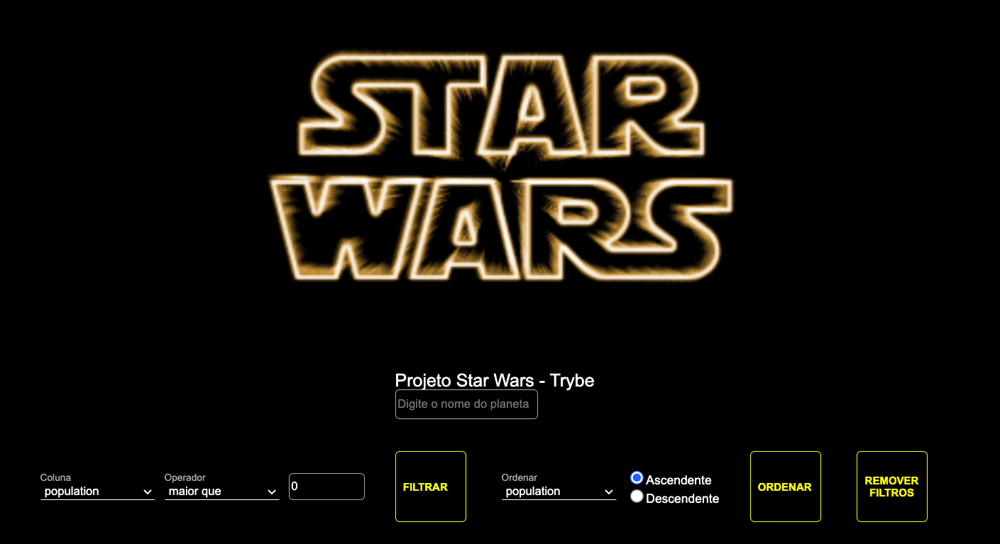

# StarWars Planets Search
<div align="center">

</div>


## Contexto

> A aplicação renderiza uma lista dos planetas da saga Starwars, é possível filtrar a lista por nome e diferentes caracteristicas dos planetas, também permite mostrar o resultado de forma descendente ou ascendente, combinar filtros e removê-los.


## Tecnologias usadas

- React Hooks
- React com Context API
- CSS module


## Instalação do projeto localmente 

1. Primeiro abra o terminal e crie um diretório com o comando <strong>mkdir</strong>:
``` 
 mkdir projetos
```

2. Entre no diretório que acabou de criar e clone o projeto:
``` 
 cd projetos
 git clone git@github.com:heidegomes/projeto-starwars-planets-search.git
```

3. Entre no diretório do projeto e instale as depenências necessárias: 
``` 
 cd projeto-starwars-planets-search
 npm install
```

4.Por fim, rode o comando e acesse o projeto via browser, no caminho:
``` 
npm start
http://localhost:3000/
```


[⬆ Voltar ao topo](#projeto-starwars-planets-search
)<br>
